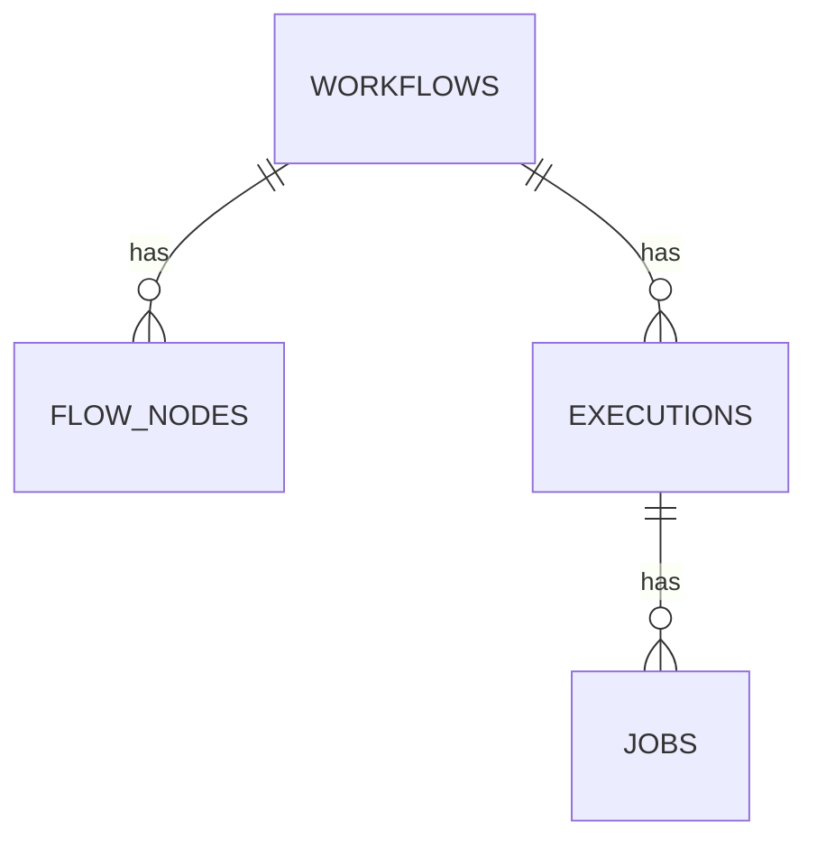

# 工作流架构与核心概念

## 架构概述

NocoBase 工作流引擎由四张核心表驱动：`workflows`（工作流定义）、`flow_nodes`（节点链）、`executions`（执行记录）、`jobs`（节点作业结果）。

编排阶段主要操作 `workflows` 和 `flow_nodes`；`executions` 和 `jobs` 是运行时自动产生的记录，**不需要人工创建**。

## 核心数据模型

| 表 | 说明 | 详细文档 |
|---|---|---|
| `workflows` | 工作流主表；`type` 为触发器类型，`config` 为触发器配置，`key` 用于版本分组，`current` 标识当前版本 | [workflows.md](workflows.md) |
| `flow_nodes` | 节点表；`upstreamId`/`downstreamId` 构成链式结构，`branchIndex` 表示分支序号，`key` 用于跨版本引用 | [flow_nodes.md](flow_nodes.md) |
| `executions` | 执行记录；`context` 为触发上下文，`status` 为执行状态，`output` 存放输出节点结果 | [executions.md](executions.md) |
| `jobs` | 节点执行记录；`nodeId`/`nodeKey` 对应节点，`status` 为节点执行状态，`result`/`meta` 存放节点输出与元数据 | [jobs.md](jobs.md) |

## 版本控制

- 同一工作流的所有版本共享同一个 `key`。
- 每个 `key` 下只有一个版本的 `current: true`，即当前生效版本。
- **已执行过的版本（`versionStats.executed > 0`）不可修改**触发器配置和节点。需要创建新版本（revision）。
- 启用工作流（`enabled: true`）会自动将其设为 `current: true`，同时将旧版本的 `current` 置为 false。
- `sync` 字段在创建后不可修改，需在 `workflows:create` 时确定。

## 变量引用语法

节点配置中通过变量引用来组织逻辑关系。

| 来源 | 语法 | 说明 |
|---|---|---|
| 触发器上下文 | `{{$context.<variableName>}}` | 触发事件产生的数据，如 `$context.data.id`、`$context.user.id` |
| 节点结果 | `{{$jobsMapByNodeKey.<nodeKey>.<variableName>}}` | 指定节点的输出值，仅能使用上游节点的变量 |
| 作用域变量 | `{{$scopes.<nodeKey>.<variableName>}}` | 仅在特定节点类型（如循环）内部可用 |

如果变量指向某张数据表结构，内部属性路径与数据表字段名一致。

## 同步与异步模式

工作流的 `sync` 字段决定执行模式，**创建后不可更改**：

| 模式 | `sync` | 说明 |
|---|---|---|
| 异步 | `false` | 触发后进入队列，后台执行，不阻塞请求。适用于大多数场景。 |
| 同步 | `true` | 触发后立即在当前请求内执行，执行结果可直接返回给调用方。适用于需要即时反馈的场景（如 Webhook、操作前拦截）。 |

部分触发器类型固定了执行模式（如 `schedule` 只能异步），具体参见各触发器文档。

## 状态码

### 执行（execution）状态

| 值 | 状态 | 说明 |
|---|---|---|
| `null` | QUEUEING | 等待处理 |
| `0` | STARTED | 执行中 |
| `1` | RESOLVED | 成功完成 |
| `-1` | FAILED | 失败（预期失败，如 end 节点设置） |
| `-2` | ERROR | 异常错误 |
| `-3` | ABORTED | 已中止（通常是运维端发起） |
| `-4` | CANCELED | 已取消（通常是业务端发起） |
| `-5` | REJECTED | 被拒绝（如审批拒绝） |
| `-6` | RETRY_NEEDED | 需要重试 |

### 节点作业（job）状态

| 值 | 状态 |
|---|---|
| `0` | PENDING（等待中，如人工节点） |
| `1` | RESOLVED |
| `-1` | FAILED |
| `-2` | ERROR |
| `-3` | ABORTED |
| `-4` | CANCELED |
| `-5` | REJECTED |
| `-6` | RETRY_NEEDED |
